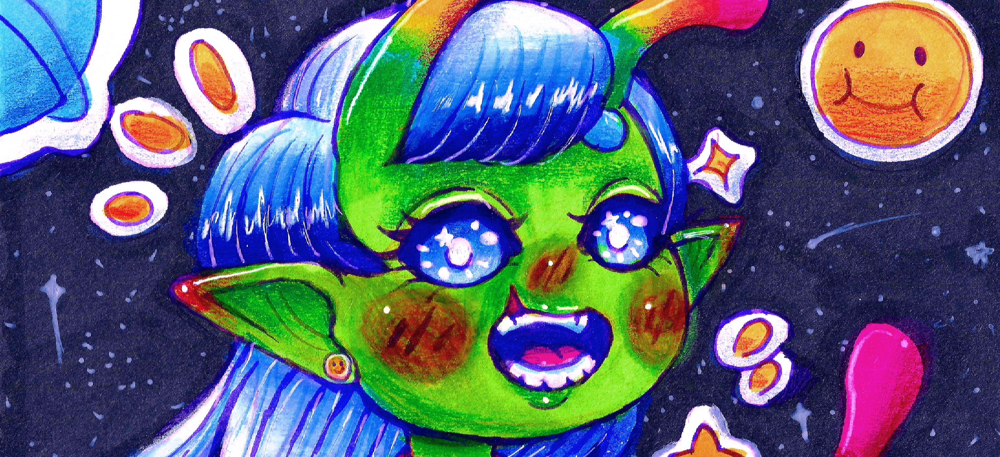

# Amandine Miranda - Étudiante en BUT Informatique

## Développeuse qui aime créer via le code, mais aussi un crayon ✏️✨

Salut ! Je me présente, je m'appelle Amandine Miranda, je suis étudiante en première année de BUT Informatique, et j'ai 21 ans :))

## Je travaille actuellement sur :

- **Projet Stargate** : Un projet codé en C# sur le logiciel Visual Studio, permettant de consulter et ajouter des missions d'exploration intergalactiques, de consulter des espèces d'aliens inconnues, en apprendre plus sur des planètes et encore plus ! Tout ça avec un interface graphique rappelant notamment le Nostromo... (Projet de 1ère année)

- **Projet Inscryption** : Inscryption est à la base, un jeu de cartes en 3D réalisé avec Unity. Ici, on nous a demandé de refaire ce jeu en Java pour qu'il soit fonctionnel dans une interface graphique de console ! (Projet de 1ère année)

## Langages connus / en apprentissage :

- C# -> Majoritairement maîtrisé, reste en apprentissage
- HTML / CSS / JavaScript -> majoritairement maîtrisé
- Java -> Encore en apprentissage, les concepts de base sont compris
- C -> Plutôt bien maîtrisé, apprentissage encore en cours

## Demandez moi si j'aime le graphisme ;)
